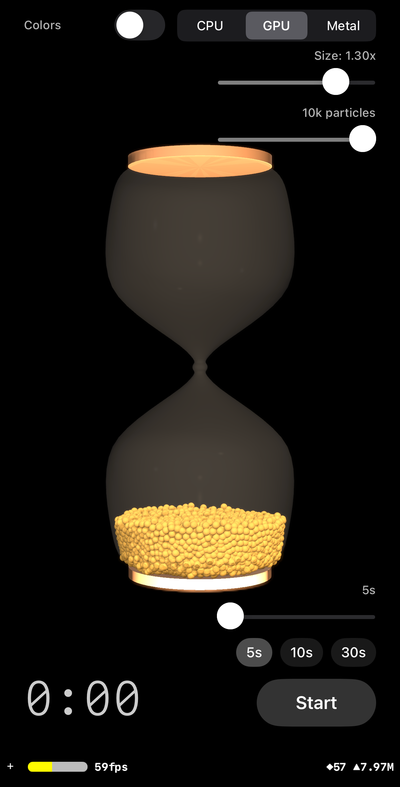

# ShiftingSands

A 3D hourglass egg timer for iPhone featuring real-time granular physics simulation. Golden sand-coloured balls tumble and flow through a procedurally-generated glass hourglass, driven by one of three physics/rendering modes — all with full O(N²) sphere-sphere collision, glass wall collision, neck friction for flow control, and gravity rotation during the flip.

<p align="center">
  
</p>

## Features

- **Three Physics Modes** — CPU (up to 250 balls), GPU (Metal compute + SceneKit nodes, up to 10,000), Metal instanced (Metal compute + mesh expansion, up to 50,000 — zero CPU readback)
- **Granular Physics** — real sphere-sphere collision at every particle count, glass wall collision, neck friction, and natural pile formation
- **3D Hourglass** — fully procedural geometry with Catmull-Rom spline glass profile, no imported 3D models
- **Flip Animation** — 180° rotation with real physics tumble as gravity direction rotates
- **Dynamic Neck** — glass narrows automatically based on particle size so one ball fits through at a time
- **25% Volume Fill** — particles sized to fill ~25% of the hourglass at all counts, with a packing correction that maintains consistent visual fill from 100 to 50,000 particles
- **Particle Count Slider** — per-mode range (50–250 CPU, 50–10,000 GPU, 50–50,000 Metal) with independent persistence
- **Particle Size Slider** — 0.5x to 1.5x multiplier (per-mode persisted) adjusts fill from a thin bottom layer to half the chamber
- **Duration Slider** — 5 to 30 seconds with gravity-scaled flow control, quick presets (5s/10s/30s), and persisted default of 5s
- **Chamber-Asymmetric Physics** — GPU/Metal use different collision strategies per chamber: lower chamber gets full impulse + aggressive damping for stable resting; upper chamber gets position correction only (no impulse) + flow damping so gravity drains the pile naturally. This solves the fundamental parallel-vs-sequential collision problem
- **Contact-Based Sleep System** — particles sleep only when in contact with other particles or the glass wall, preventing mid-air freezing. Eliminates shimmer/flicker from parallel collision resolution while ensuring particles always fall correctly
- **Active Controls** — mode, count, and size controls stay enabled during animation; mode changes restart instantly, slider changes apply on next start/reset
- **Random Colors** — toggle "Colors" to give each particle a random colour; CPU/GPU modes use a 24-color palette for performance (shared per-node materials, not individual copies per particle); Metal mode uses per-vertex colours in mesh expansion
- **Clean Reset** — manual reset respawns particles cleanly; natural timer completion leaves particles at rest where they settled
- **Persistent Settings** — physics mode, per-mode particle count, per-mode size multiplier, and duration (default 5s) saved across launches
- **120fps ProMotion** — adaptive substeps maintain smooth frame rate
- **Digital Readout** — monospaced countdown overlay
- **CLI Arguments** — launch with `-mode cpu|gpu|metal`, `-count N`, `-size F`, `-dumpspawn` for automated testing and debugging
- **Unit Tests** — 16 Swift Testing framework tests covering CPU physics, GPU physics, and spawn packing validation

## Requirements

- iOS 17.0+
- Xcode 16+
- iPhone only (portrait)

## Getting Started

1. Open `ShiftingSands.xcodeproj` in Xcode
2. Select an iPhone simulator or connected device
3. Build and run (Cmd+R)
4. Choose **CPU**, **GPU**, or **Metal** physics mode with the segmented picker (top right)
5. Adjust particle count, particle size, and duration with the sliders, or use a quick preset. Toggle **Colors** for random per-particle colours. Tap **Start**
6. The hourglass flips and balls begin to flow through the neck

## How It Works

The hourglass is built entirely from code — no 3D model files. An 11-point profile curve is interpolated with Catmull-Rom splines into ~80 smooth points, then rotated around the Y axis as a surface of revolution. Two glass surfaces exist: a visible outer shell with Blinn specular highlights, and an invisible inner shell that provides collision boundaries for the physics simulation.

The neck width is dynamic — it adjusts based on the current particle radius so exactly one ball fits through at a time, creating natural single-file flow and satisfying jamming behaviour.

### CPU Physics

The CPU engine runs O(N²) sphere-sphere collision on a single thread, practical up to ~250 particles at 120fps:
- **Sphere-sphere collision** — position correction and velocity exchange along collision normals
- **Glass wall collision** — exploits rotational symmetry to reduce to a 2D radial check
- **Gravity rotation** — during the flip, world gravity is transformed into the hourglass's rotating local frame

### GPU Physics (Metal Compute)

The GPU engine parallelises the same O(N²) collision across Metal compute threads, enabling up to 10,000 particles:
- **One thread per particle** — each thread resolves all collisions for its particle independently
- **Double-buffered data** — read from buffer A, write to buffer B, swap per substep to avoid race conditions
- **Pre-computed wall profile** — 256-entry radius lookup table for O(1) glass wall collision on GPU
- **Chamber-asymmetric resolution** — lower chamber: full position correction + velocity impulse for stable settling. Upper chamber: position correction only (no impulse) so gravity drains the pile — parallel impulses would cancel gravity and jam the pile
- **CPU readback** — positions are read back from GPU each frame to update N individual SCNNode positions

### Metal Instanced (Mesh Expansion)

The Metal mode eliminates the CPU readback bottleneck, enabling up to 50,000 particles:
- **Same GPU physics** — reuses `MetalPhysicsEngine` compute kernels for all physics
- **Mesh expansion compute kernel** — a second GPU pass expands each particle position into a subdivided icosahedron mesh (42 vertices, 80 triangles per particle) for nearly-spherical appearance matching CPU/GPU mode spheres
- **Zero CPU readback** — `SCNGeometrySource(buffer:)` wraps the expanded vertex MTLBuffer directly; SceneKit renders the triangle geometry through its standard pipeline
- **Lambert material** — golden sand colour with Lambert shading (diffuse only, no specular/Fresnel blowout), avoiding the specular highlights that can overwhelm particle appearance at high counts and rendering speeds

### Flow Control

Flow rate is controlled by **gravity scaling** combined with neck friction. At the shortest duration (5s), gravity is at full strength and particles fall quickly. At longer durations, gravity is reduced so particles fall more gently and trickle through the neck slowly. Neck friction provides additional damping near the constriction, scaled by duration. The result is natural-looking flow at all timer settings.

The flip animation exploits the glass's Y-axis symmetry — rotating 180° produces an identical shape, so euler angles snap back to zero after the rotation. The granular simulation shows real physics throughout the flip — balls tumble naturally as gravity rotates.

### Lighting

A 5-point rig uses deliberately low intensity to let the sand colour show through:
- **Key light** — warm (5000K) from upper right, 120 intensity, casts shadows
- **Front fill** — from camera direction, 100 intensity (4500K)
- **Side fill** — cool light (6500K) from left, 60 intensity
- **Rim light** — from behind, 60 intensity (5500K)
- **Bottom fill** — omni light below, 8 intensity (4500K)

Particles use **Lambert material** with golden sand colour (0.76/0.60/0.28) — diffuse only, no specular highlights — to avoid the specular blowout that can overwhelm appearance at high particle counts.

## Build

```bash
# Build
xcodebuild -project ShiftingSands.xcodeproj -scheme ShiftingSands \
  -destination 'generic/platform=iOS' build \
  CODE_SIGNING_ALLOWED=NO 2>&1 | tail -5

# Run tests (CPU and GPU physics engines)
xcodebuild -project ShiftingSands.xcodeproj -scheme ShiftingSands \
  -destination 'platform=iOS Simulator,name=iPhone 16 Pro' test \
  CODE_SIGNING_ALLOWED=NO
```

## Future Direction

Spatial hashing for O(N) collision detection could push particle counts well beyond 50,000.

## Architecture

See [architecture.html](architecture.html) for interactive diagrams and [CLAUDE.md](CLAUDE.md) for the full developer reference.
